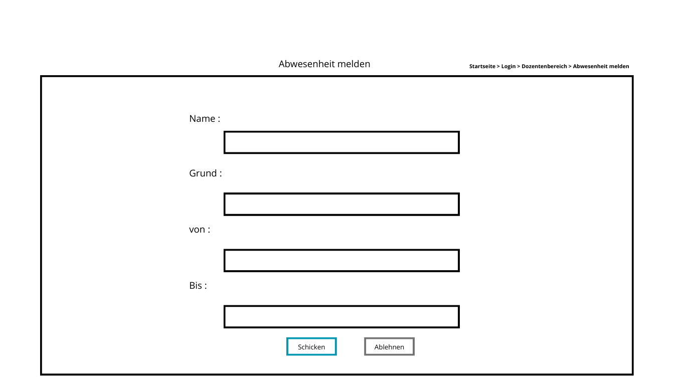

# Einsatzplan

# Inhaltsverzeichnis

1. Einleitung
    - 1.1 Einleitung
    - 1.2 Rahmenbedingungen
2. Anforderungen
    - 2.1. Allegemeine Anforderungen
    - 2.2. funktionale Anforderungen
    - 2.3. Nichtfunktionale Anforderungen
3. Use Case (Anwendungsfälle)
    - 3.1 Use Case Diagramm
    - 3.2 Optional weitere Use Case Diagramme
4. Architektur
5. Geschäftprozesse
    - Beschreibung Laufzeit des Systems 
6. Datenmodell
7. GUI-Design
8. Klassendiagramm

***

# 1. Einleitung

## 1.1 Einleitung

In diesem Projekt geht es um die Entwicklung einer Software Lösung, die Stundenpläne automatisch erzeugt und an der akademischen Gemeinschaft von "Wissen für Alle - die Wissensakademie" vergeben musst.

## 1.2 Rahmenbedingungen

Vorher wurde die Plannung manuell gemacht, aber da das Geschäft sich stark entwickelt hat. Braucht die Administration eine bessere Art und Weise, die Plannug von Kurse :
 - zu erstellen, 
 - zu modifizieren 
 - und an Studierende und Dozenten von verschiedene Standorten zu teilen.

# 2. Anforderungen

## 2.1. Allgemeine Anforderungen

- Dozenten dürfen maximal 16 Stunden pro Woche eingesetzt sein. 
- Studenten müssen nachschauen ob eine Vorlesung stattfindet oder nicht
- Bei verschiedenen Standorten benötigen Dozenten 2 Stunden anreise Zeit
- Jede Woche soll ein neuer Stundenplan erstellt werden

## 2.2 Funktionale Anforderungen

Das System muss allgemein diese Funktionalitäten beinhalten :

 1. Jeder Benutzer musst sich einloggen, bevor auf seinem Bereich zuzugreifen

 2. Im Allgemeinem Bereich sollen alle Studenten ihren Stundenplan ihres Semesters und Fachbereich einsehen können
 
 3. Ein Studierende musst in der Lage sein :
    - Seinen Stundenplan einzusehen
    
 4. Ein Dozent musst in der Lage sein 
    - seinen Stundenplan einzusehen
    - Seine Abweseheit zu melden
    
 5. Ein Admin musst in der Lage sein :
    - Sich alle Abwesenheiten anzugucken
    - Abwesenheiten bestätigen oder ablehnen
    - Einen Studenplan zu generieren
    - Einen Stundenplan einzusehen
    - Nach einer einer Generierung oder einer Veränderung eines Stundenplans eine Email zur Signalisierung der Vervügbarkeit an alle Studierende und Dozenten Schicken

 6. Ein Stundenplan musst Name des Lehrers beinhalten, des Kurses und des Raums.
    

##  2.3. Nichtfunktionale Anforderungen

Diese Qualitäten musst das System erfüllen :

 - Benutzerfreundlich
 - Intuitiv
 - Sicher(Ein Studierende oder Dozent darf nie auf den Adminbereich zugreifen )
 - Lesbar
 - System soll verfügbar sein außer bei Updates

# 3. Use Case 
  Für einen Studierende
  

  Für einen Dozent
  

  Für einen Admin
  

# 6. Datenmodell

Es wird eine My-sql Datenbank verwendet

# 7. GUI-Design

  Allgemein
  
  

  Für einen Studierende
  
  

  Für einen Dozent
  
  
  

  Für einen Admin
  
  
  