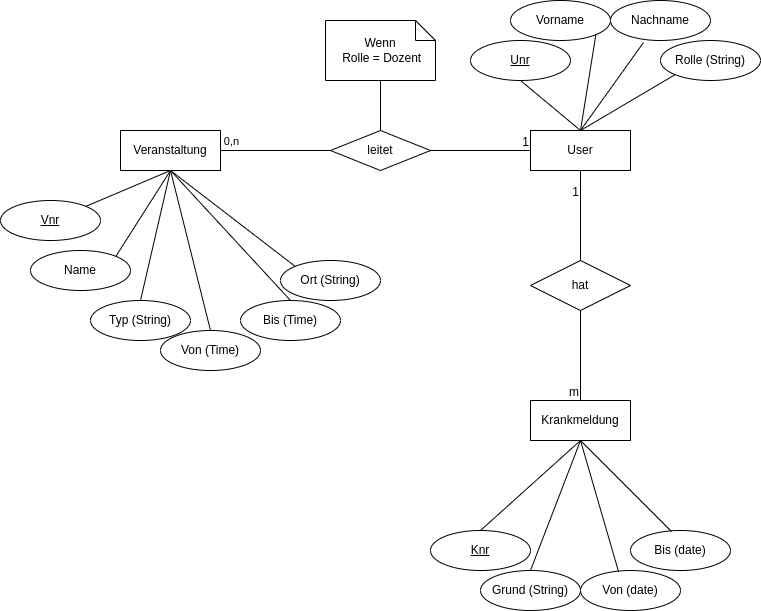
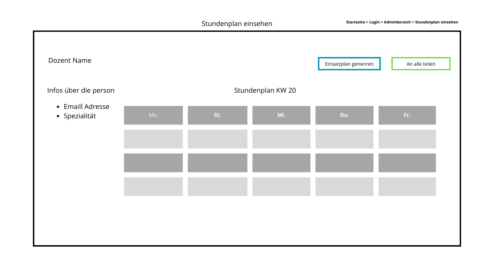

# Einsatzplan für die Firma "Wissen für Alle - die Wissensakademie"

# Inhaltsverzeichnis

1. Einleitung
    - 1.1 Einleitung
    - 1.2 Rahmenbedingungen
2. Anforderungen
    - 2.1. Allegemeine Anforderungen
    - 2.2. funktionale Anforderungen
    - 2.3. Nichtfunktionale Anforderungen
3. Use Case (Anwendungsfälle)
    - 3.1 Use Case Diagramm
    - 3.2 Optional weitere Use Case Diagramme
4. Architektur
5. Geschäftprozesse
    - 1. _use case Generierung eines Einsatzplan_
    - 2. _use case Abwesenheintmeldung einer Lehrperson_
6. Datenmodell
7. GUI-Design
8. Klassendiagramm

***

# 1. Einleitung

## 1.1 Einleitung

In diesem Projekt geht es um die Entwicklung einer Software Lösung, die Stundenpläne wöchentlich, automatisch erzeugt und an der akademischen Gemeinschaft von "Wissen für Alle - die Wissensakademie" vergeben musst.

## 1.2 Rahmenbedingungen

Vorher wurde die Mitarbeiter Einsatztplannung manuell gemacht, aber da das Geschäft sich stark entwickelt hat. Braucht die Administration eine bessere Art und Weise, die Plannug von Kurse :
 - zu erstellen, 
 - zu modifizieren 
 - und an Studierende und Dozenten von verschiedene Standorten zu teilen.
 es gibt Ü, V, dauern 2 Stunden

 Was ist das Problem
 Wie löse ich das Problem
 Achten auf Grammatik

# 2. Anforderungen

## 2.1. Allgemeine Anforderungen(gehören zu Rahmenbedingungen)

- Dozenten dürfen maximal 16 Stunden pro Woche eingesetzt sein. 
- Studenten müssen nachschauen ob eine Vorlesung stattfindet oder nicht
- Bei verschiedenen Standorten benötigen Dozenten 2 Stunden anreise Zeit
- Jede Woche soll ein neuer Stundenplan erstellt werden

## 2.2 Funktionale Anforderungen

Das System muss allgemein diese Funktionalitäten beinhalten :

 1. Jeder Benutzer musst sich einloggen, bevor auf seinem Bereich zuzugreifen

 2. Im Allgemeinem Bereich sollen alle Studenten ihren Stundenplan ihres Semesters und Fachbereich einsehen können
 
 3. Ein Studierende musst in der Lage sein :
    - Seinen Stundenplan einzusehen
    
 4. Ein Dozent musst in der Lage sein 
    - seinen Stundenplan einzusehen
    - Seine Abweseheit zu melden
    
 5. Ein Admin musst in der Lage sein :
    - Sich alle Abwesenheiten anzugucken
    - Abwesenheiten bestätigen oder ablehnen
    - Einen Studenplan zu generieren
    - Einen Stundenplan einzusehen
    - Nach einer Generierung oder einer Veränderung eines Stundenplans eine Email zur Signalisierung der Vervügbarkeit an alle Studierende und Dozenten Schicken

 6. Ein Stundenplan musst Name des Lehrers beinhalten, des Kurses und des Raums.
    

##  2.3. Nichtfunktionale Anforderungen

Diese Qualitäten musst das System erfüllen :

 - Benutzerfreundlich
 - Intuitiv
 - Sicher(Ein Studierende oder Dozent darf nie auf den Adminbereich zugreifen )
 - Lesbar
 - Auf alle Geräte-typen zugreifbar
 - System soll verfügbar sein außer bei Updates

# 3. Use Case 
- Für jeder Use Case Beschreibung fällt
- Voraussetzungen
- Person kann das.(statich)
## 3.1 Use Case Diagramm

  Für einen Studierende
  

  Für einen Dozent
  

  Für einen Admin
  

## 3.2 Optional weitere Use Case Diagramme
    
  Für einen Admin
  
    

# 4. Architektur

Welche Entscheidungen haben wir uns für die realisiereung des Lösung des System
Architektur(ein bild reicht)
Wir entscheiden uns für eine Web-App, da man auf alle Geräte und von überall zugreifen kann.
Die App wird diese Technologien benutzen:
  - Backend: Mit Python, weil es einfach zu lernen ist, HTTP Anfragen gut unterstüzt, was sehr wichtig für eine Web-App ist, und es gibt. große Entwickler Community.
  - Frontend: Mit HTML, CSS und JS, weil alle Browser das kann, große Entwickler Community die es benutzt, Programmierer haben, damit Erfahrung.
  - Datenbank: Mit MySQL, strukturiert, gut für das Suchen, große Entwickler Community

# 5. Geschäftprozesse
  - Sequenzdiagramm
- Beschreibung Laufzeit des Systems
    
   5.1. _use case Generierung eines Einsatzplan_
        
        Ein Admin loggt sich im System ein und generiert einen Einsatztplan.
        Nach der generierung soll eine Benachritigung per Mail an Studierende geschickt werden .

   5.2. _use case Abweseheintmeldung einer Lehrperson_
    
        Eine Lehrperson loggt sich in seinen Bereich ein, füllt das Formular(Name, Grunc, Datum) aus, und schickt es.
        Ein Admin listet alle Abwesenheiten und hat die Möglichkeit zu akzeptieren oder abzulehnen.
        Eine Annahme löst eine neue generierung des Einsatzplan und das Schicken eine Mail an alle Dozenten und Studierende.

   5.3. _use case Abwesenheitmeldungen einsehen_
        
        Nach dem Login kann ein Admin alle Meldungen sehen, sie bestätigen oder ablehnen.

   5.4 _use case was eine Krankmeldung auslöst_

# 6. Datenmodell

Es wird eine My-sql Datenbank verwendet
Orte hinzufügen

# 7. GUI-Design

  Allgemein
  
  

  Für einen Studierende
  
  

  Für einen Dozent
  Abwesendheitsgrund für den Formular
  
  
  

  Für einen Admin
  
  
  

  Aufwandschätzung
